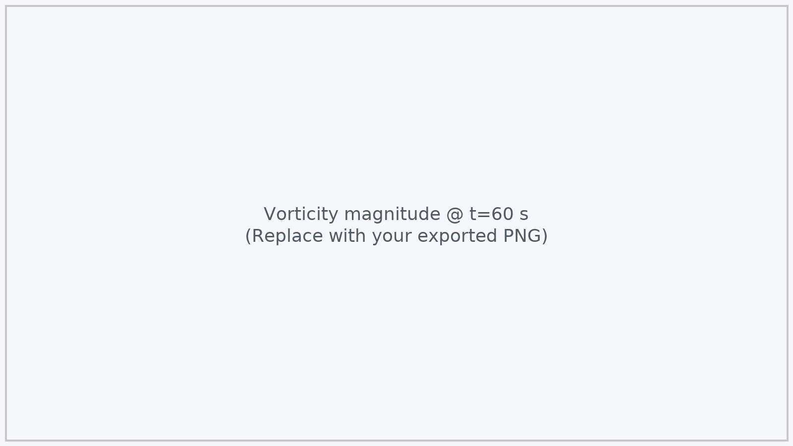
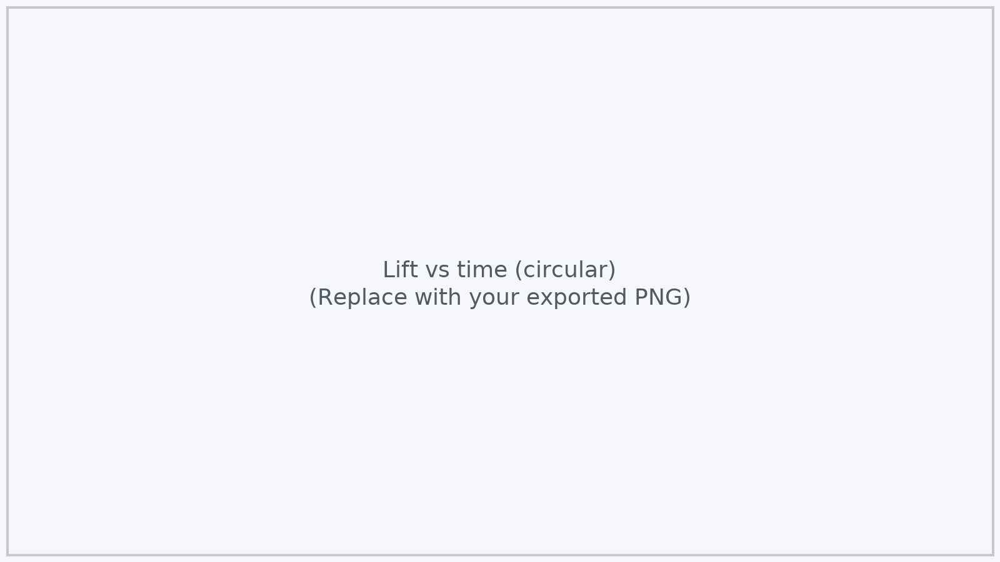
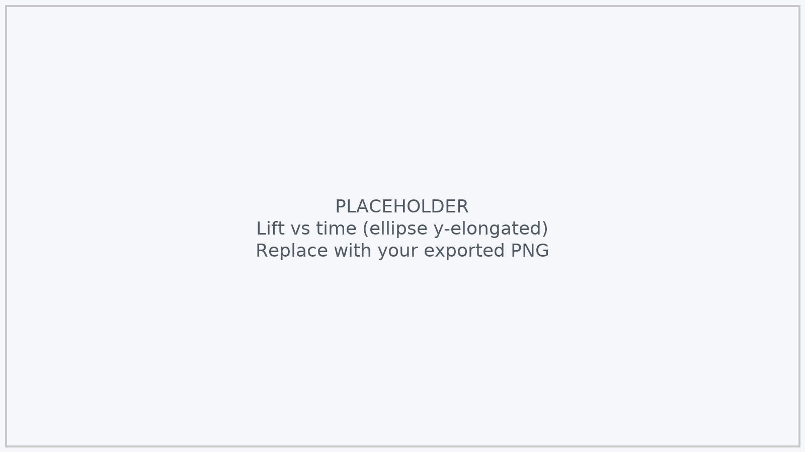
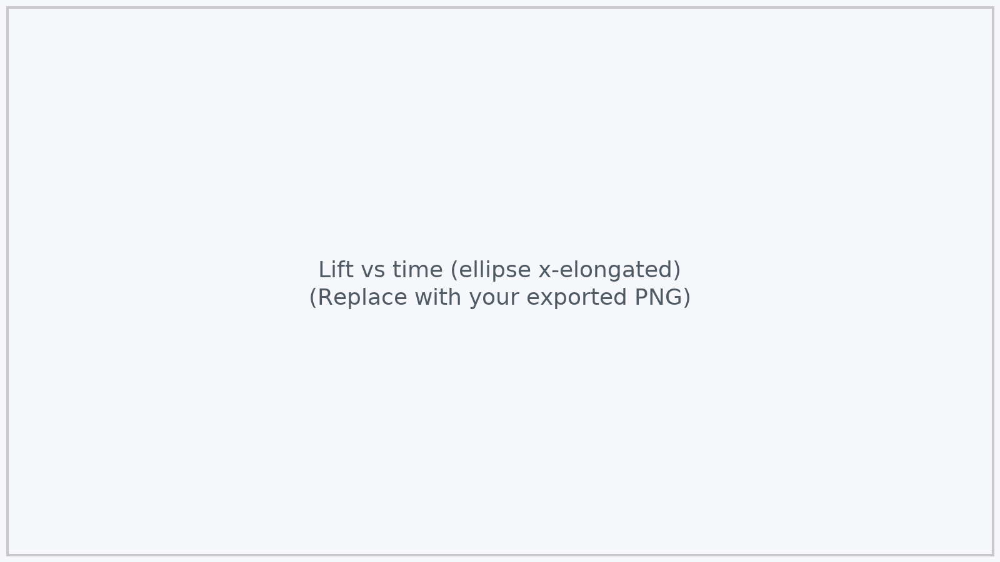

# Goutham Shimoga Umesh — Applied CFD Portfolio
_Aerospace MS @ ASU • CFD | Aerodynamics | Heat Transfer • ANSYS Fluent 2023/2024_

[LinkedIn](www.linkedin.com/in/goutham07) · [Email](gouthamshimogaumesh@gmail.com) · [Resume (PDF)](./Goutham_Shimoga_Umesh_Resume.pdf)

---

## Featured Projects (Top 5 kept tight — currently 1 shown)

### Flow Past Cylinders — Vortex Shedding (2D, Transient)

**Objective.** Resolve unsteady bluff-body wake and quantify shedding (lift waveform, period, Strouhal).  
**Domain.** 2D channel with circular/elliptical obstacle; diesel (ρ=730 kg/m³, μ=0.0024 kg·m⁻¹·s⁻¹).

**Setup.** ANSYS Fluent 2023 R1 · Laminar · Inlet U=0.05 m/s · Outlet p=0 · Top/Bottom slip · No-slip cylinder  
Mesh: ~**56k nodes / 56k elems** · Δt=**0.05 s** · **60** iters/step · **t = 60 s** (≈1200 steps)

**Key numbers (circular, D=0.04 m)**  
| Metric | Value |
|---|---|
| Reynolds number, Re | **≈ 608** |
| Lift amplitude, (max–min)/2 | **0.0428 N** |
| Shedding period, T | **3.65 s** |
| (Implied) frequency, f = 1/T | **0.274 Hz** |
| (Implied) Strouhal, St = f·D/U | **≈ 0.22** |

**Elliptical variants (5×3 cm axes)**  
| Body | Lift amplitude (N) | Period (s) |
|---|---:|---:|
| Circular (baseline) | **0.0428** | **3.65** |
| Ellipse, major ⟂ flow (y-elongated) | **0.0674** | **4.05** |
| Ellipse, major ∥ flow (x-elongated) | **0.0127** | **3.05** |

**Figures.**  
  
*Spanwise alternating wake, clear shear-layer roll-up.*

  
*Closed recirculation bubble and periodic shedding cells downstream.*

  
*Von Kármán street resolved with smooth core formation.*

  
*Limit-cycle oscillation; clean sinusoid after spin-up.*

  

**Takeaway.** Mesh/Δt capture a stable Kármán street; **St ≈ 0.22 @ Re≈608** and geometry strongly modulates lift amplitude (y-elongated > circular » x-elongated).

---

## Methods & Tools
ANSYS Fluent (pressure/density-based), steady & transient · Turbulence: k–ω SST / k–ε; laminar where applicable · VOF & surface tension when relevant · Documented Δt, iters/step, mesh metrics · Validation via Strouhal, ΔT budget, Mach trends, convergence plots.

---

## Contact
**Email:** you@example.com · **LinkedIn:** https://www.linkedin.com/in/YOUR-HANDLE · **GitHub:** https://github.com/YOUR-USERNAME
